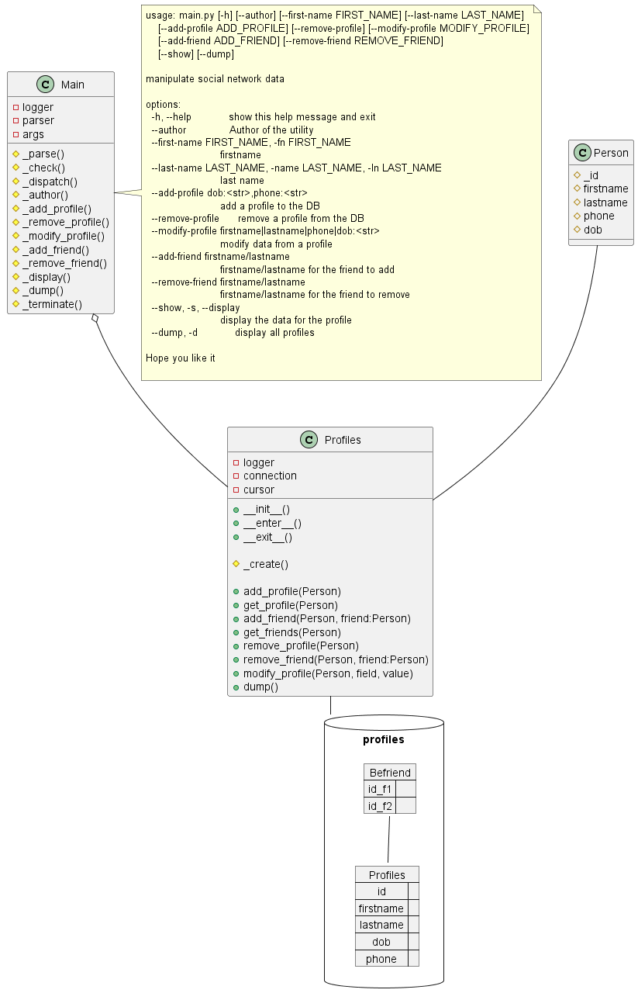

# Graphs & SQL

## Problem Statement
The popular social network Facebook TM or Instagram was founded by Mark Zuckerberg and his classmates at Harvard University in 2004. At the time, he was a sophomore studying computer science.

Design and implement an application that maintains the data for a simple social network. Each person in the network should have a profile that contains the person’s name. Your application should allow a user to join the network, leave the network, create a profile, modify the profile, search for other profiles, and add and remove friends.

A simple approach:
- Use a graph data structure to design the network of your social media application.
- Add profiles (or accounts) to the application (add a vertex to the graph). You can create a profile class with attributes like name, email, and phone number.  Then add the profiles to the graph.
- Remove profiles from the application (remove a vertex from the graph.)
- Create a friendship between two profiles. (Add an edge between two vertexes.)
- Remove friendship (remove the edge between two vertexes)
 

You need to implement CRUD (In computer programming, create, read, update, and delete (CRUD) are the four basic functions):
C= Create: Add profile- Add friends
R= Read: Read the information of a profile - Search for other profiles
U= Update: Update and edit the profile - Update the friend list
D= Delete: Delete a profile - Delete a friend of a profile.

## Proposed Solution

For the final hand-on part, I used the module sqlite3 to represent the graph data structure capturing the vertices (the profiles) and the edges (the friendship relationship between the profiles).
[sqlite3](https://www.sqlite.org/). is a python module aiming at processing SQL requests on a highly optimized SQL binary file. No need to have a SQL server ala MySQL or PostgresSQL, sqlite is
based on small optimized local files accessible from the file system like any other files.

Since the sqlite files are binaries, they can be visualized by free tool (like [sqlite DB browser](https://sqlitebrowser.org/dl/)) or plugins. For those using Visual Studio IDE, see below an example of such visualization:

The profiles (aka vertices or nodes) and friend relationships (aka edges or links) are captured as two tables as follow. Stakeholders (like Profiles) are represented with tables having a common noun as names (like "Profiles") while actions
(like relationships) are represented with tables having verbs as names (like "Befriend"). The later aims at connecting stakeholders according to the cardinality of the relationships between tables. Here, a profile may have none to many
friends meaning the friendship table "Befriend" may have multiple entries for every profile.  

    CREATE TABLE IF NOT EXISTS Profiles (
        id INTEGER PRIMARY KEY ASC AUTOINCREMENT,
        lastname VARCHAR(100) NOT NULL,
        firstname VARCHAR(100) NOT NULL,
        phone VARCHAR(100),
        dob VARCHAR(100),
        UNIQUE (firstname,lastname)
    )
    
    CREATE TABLE IF NOT EXISTS Befriend (
        id_f1 INTEGER NOT NULL,
        id_f2 INTEGER NOT NULL,
        FOREIGN KEY (id_f1)
            REFERENCES Profiles(id)
        FOREIGN KEY (id_f2)
            REFERENCES Profiles(id)
        CHECK (id_f1 <> id_f2)
        UNIQUE (id_f1,id_f2)
    )
    
 The definition of the tables is quite important, it what will make the queries to retrieve the profiles and their associated friends efficient, hence a particular attention to the declaration of the primary keys, foreign keys and eventually relationships  between fields.

Another important aspect of RDBM (Relation DataBase Management system) is limiting the redundancy of information, hence aiming at [normalizing](https://www.geeksforgeeks.org/boyce-codd-normal-form-bcnf/) the RDBM into 3NF (or more of possible).
In the Profiles/Befriend RDBM, the RDBM is so minimalistic that it's already in Boyce-Codd Normal Form (BCNF) i.e. quite optimized representation.

## UML Diagram

